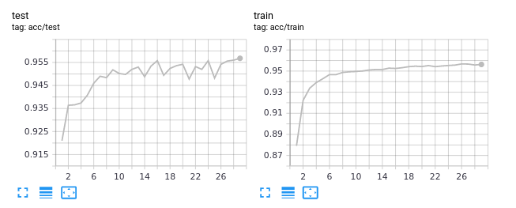

# Homomorphic MNIST
Demo of MNIST pipeline which uses Homomorphic encryption to classify digits on untrusted server.
<p align="center">
  
</p>


-TBD homomorphic encryption

# Deep learning model training
`./train` folder includes the pytorch deep learning pipeline based on MNIST dataset.
* [`train.py`](train.py) - Source code for the training and evaluation process of the MNIST network.
The training process is visualized using tensorboard library.
During the training best models parameters are stored into .csv files which then can be coppied to `untrusted server` implementation.
* [`batchers/mnist_batcher.py`](train/batchers/mnist_batcher.py) - Dataset which return MNIST training/testing examples. The input image is encoded as `1.0` or `0.0` without the intermedient values - this is done so the user input data (from client frontend) has the same distribution.
* [`models/mnist_classifier.py`](train/batchers/mnist_classifier.py) - Neural network module. For this demo a network build from 2 fully connected layers where trained, with `x^2` activation function (with small network this activation performs good and provide a simple implementation using homomorphic encryption operations).
 
This simple network achieves 95% accuracy on MNIST dataset:


# Evaluation
### Client frontend
Simple React app which includes an area where user can draw a number and send the classification request.
I experimented with [palisade-wasm](https://gitlab.com/palisade/palisade-wasm) implementation but I could not managed to make it working with React.

### Client backend
C++ server which is used to encrypt the user input using homomorphic CKKS schema (based on [palisade](https://gitlab.com/palisade/palisade-development) library.
The CORS mechanism is not implemented in the C++ code so CORS disable browsers pluggins shall be used.
NodeJS implementation using [palisade-wasm](https://gitlab.com/palisade/palisade-wasm) did work but the serialization operation seems to have an [issue](https://gitlab.com/palisade/palisade-wasm/-/issues/6).

### Server
Similar to Client backend - C++ server using palisade library.
This server playes an example of an untrusted 3rd party server, which run the calculation but shall not have access to any information about user input.

The server performs the following operation:
1. Receive and save the serialized encrypted data. The `cryptocontext` (information about used encryption schema/parameters), `keys` (public keys used for CKKS operations - automorphism/rotation, relinearization/multiplication, summation and generica public key ) and `ciphertext` (encrypted user input) needs to be received by the server. The size of the encrypted data can be very large - reaching Gigabytes for simple examples.
2. After all files are received the server deserializes the data.
3. Neural network is run on the encrypted data.
4. Final Ciphertext is send back to the client backend for decoding.

Linear neural network implementation using CKKS operations:
```c++
Ciphertext<DCRTPoly> linear(CryptoContext<DCRTPoly> cc, Ciphertext<DCRTPoly> cInput, vector<vector<double>> w, vector<double> b){
  Plaintext w_ptxt;
  Plaintext b_ptxt;
  
  // y1 = input*W
  vector<Ciphertext<DCRTPoly>> wRows;
  for (auto i=0; i<w.size(); i++){
    w_ptxt = cc->MakeCKKSPackedPlaintext(w[i]);
    auto cTemp = cc->EvalMult(cInput, w_ptxt);
    auto cRowSum = cc->EvalSum(cTemp, 1024);
    wRows.push_back(cRowSum);
  }
  Ciphertext<DCRTPoly> cY1 = cc->EvalMerge(wRows);

  // y2 = y1+b
  b_ptxt = cc->MakeCKKSPackedPlaintext(b);
  Ciphertext<DCRTPoly> cY2 = cc->EvalAdd(cY1, b_ptxt);

  return cY2;
}
```
Activation function for the MNIST network is coded as `x^2` operation:
```c++
Ciphertext<DCRTPoly> y = cc->EvalMult(x, x); /* x^2 as nonlinearity */
```
